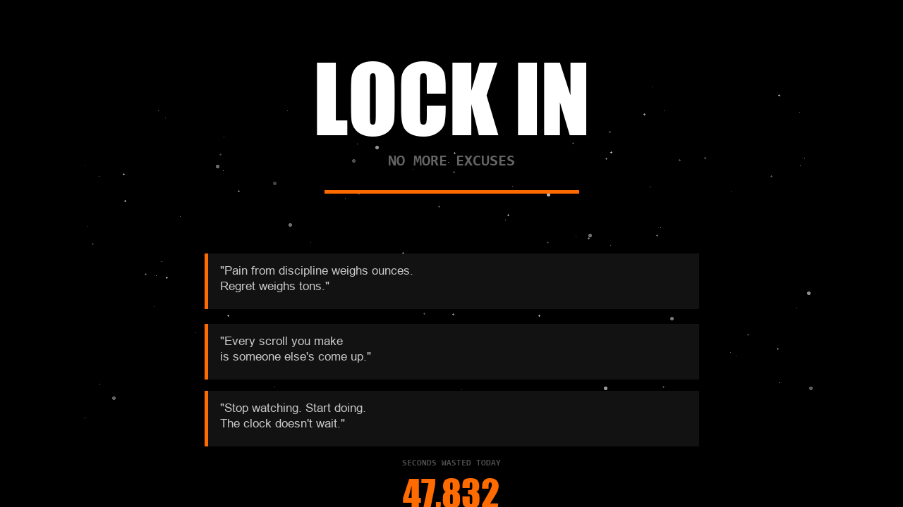
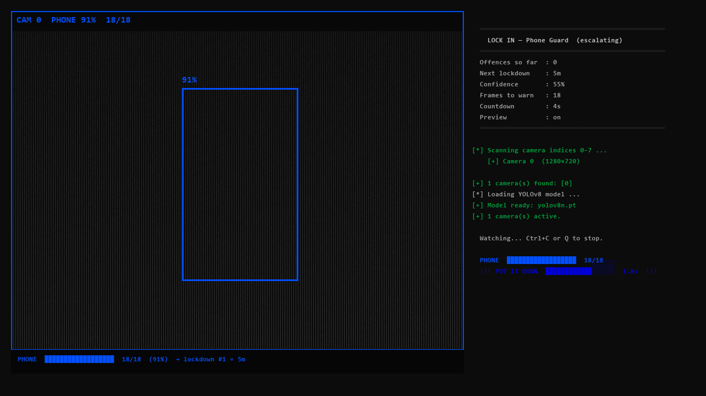
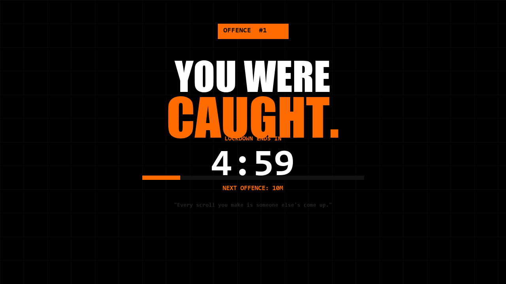
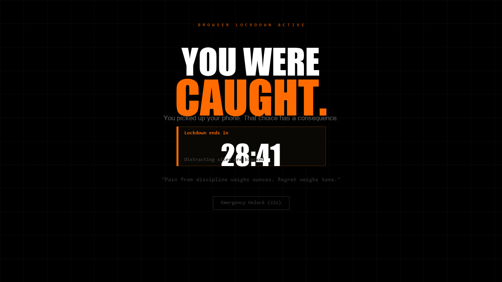

# LOCK IN — No More Excuses

A three-part accountability system that watches your camera, catches you picking up your phone, and punishes you for it — harder every single time.

---

## Screenshots

### Motivational Website


### Python Phone Guard — Live Detection


### Lockdown Overlay — Full Screen Block


### Chrome Extension — Blocked Page


---

## What It Does

| Component | What it is |
|---|---|
| **Motivational Website** | A full-screen Three.js site with brutal quotes, a live "seconds wasted" counter, and a homeless silhouette to show you where comfort leads |
| **Python Phone Guard** | Runs your webcam through YOLOv8 AI. Detects your phone. Opens a fullscreen lockdown page in Chrome and locks Windows. **Every offence doubles the next lockdown.** |
| **Chrome Extension** | Browser-native phone detection using TensorFlow.js. Blocks YouTube, Instagram, Reddit, TikTok, Netflix and more the moment a phone is spotted. |

---

## Folder Structure

```
Motivational-LOCK-IN/
│
├── README.md
│
├── web/                        # All HTML/CSS/JS — open directly in any browser
│   ├── index.html              # Main motivational site (Three.js galaxy + quotes)
│   ├── detector.html           # Standalone browser phone detector (no extension needed)
│   └── locked.html             # Fullscreen lockdown page shown by the Python script
│
├── python/                     # Python phone guard script
│   ├── phone_guard.py          # Main script — multi-camera, escalating lockdown
│   ├── requirements.txt        # pip dependencies
│   ├── setup_and_run.bat       # First-time setup + launch (Windows)
│   ├── run.bat                 # Quick launch after first setup
│   └── lockdown_state.json     # Auto-created — tracks offence count & duration
│
└── extension/                  # Chrome / Edge browser extension
    ├── manifest.json
    ├── background.js           # Blocks sites, manages lockdown timer
    ├── detector.html           # Camera detection page (opened via toolbar icon)
    └── blocked.html            # Page shown when a blocked site is visited
```

---

## Setup

### 1. Motivational Website

No setup. Double-click `web/index.html` to open in your browser.

---

### 2. Python Phone Guard (recommended — most powerful)

**Requirements:** Python 3.10+ with "Add to PATH" checked during install.

**First time:**
```
double-click  python/setup_and_run.bat
```
This installs `ultralytics` and `opencv-python`, downloads the YOLOv8 model (~6 MB), and starts watching.

**After that:**
```
double-click  python/run.bat
```

**What happens when your phone is spotted:**
1. Progress bar fills as the AI confirms the detection across frames
2. A **countdown starts** — put the phone down and the lock cancels
3. If you hold it past the countdown:
   - A fullscreen Chrome kiosk page (`web/locked.html`) takes over your screen
   - Windows locks
   - The timer counts down — Chrome closes automatically when done
4. **Every offence doubles the next lockdown** (saved to `lockdown_state.json`)

| Offence | Lockdown |
|---|---|
| #1 | 5 min |
| #2 | 10 min |
| #3 | 20 min |
| #4 | 40 min |
| #5 | 80 min |
| #6+ | 2 hours (max) |

To **reset** your offence count, delete `python/lockdown_state.json`.

**Key settings** (top of `phone_guard.py`):
```python
CONFIDENCE_MIN      = 0.55    # how sure the AI must be (lower = more sensitive)
FRAMES_TO_WARN      = 18      # frames before countdown (~0.6 s at 30 fps)
COUNTDOWN_SECS      = 4       # seconds to put phone down before lock fires
BASE_LOCKDOWN_SECS  = 300     # first offence duration (300 = 5 min)
LOCKDOWN_MULTIPLIER = 2.0     # multiplier per offence (2.0 = doubles)
MAX_LOCKDOWN_SECS   = 7200    # hard cap (7200 = 2 hours)
SHOW_WINDOW         = True    # False = fully silent / headless
CAMERA_INDICES      = 'auto'  # 'auto' or a list like [0, 1, 2]
MODEL               = 'yolov8n.pt'  # swap to yolov8s.pt for better accuracy
```

---

### 3. Chrome Extension

**Install (one time):**
1. Open Chrome or Edge → `chrome://extensions`
2. Enable **Developer mode** (top-right toggle)
3. Click **Load unpacked**
4. Select the `extension/` folder
5. The **LOCK IN** icon appears in your toolbar

**Use:**
- Click the toolbar icon → opens the camera detector tab
- Allow camera access once, then leave the tab open

**Blocked sites during lockdown:**
YouTube · Instagram · X/Twitter · TikTok · Reddit · Facebook · Netflix · Twitch · Snapchat · Pinterest

**Lockdown durations:** 15 min / 30 min / 1 hr / 2 hr (selectable in the detector tab)

---

## Tech Stack

| Layer | Technology |
|---|---|
| 3D visuals | [Three.js](https://threejs.org) r128 |
| Phone detection (Python) | [YOLOv8](https://github.com/ultralytics/ultralytics) via Ultralytics |
| Phone detection (browser) | [TensorFlow.js](https://www.tensorflow.org/js) + COCO-SSD |
| Camera capture | OpenCV (`cv2`) |
| Windows lock | `ctypes.windll.user32.LockWorkStation()` |
| Browser blocking | Chrome MV3 `declarativeNetRequest` |
| Fonts | Anton · Oswald · Space Mono (Google Fonts) |

---

## Which Should I Use?

| Situation | Best option |
|---|---|
| You want the harshest punishment | **Python script** — locks the whole computer |
| You want always-on background detection | **Python script** — runs silently with `SHOW_WINDOW = False` |
| You only want to block distracting websites | **Chrome Extension** |
| You don't want to install Python | **Browser detector** (`web/detector.html`) |
| Multiple monitors / cameras | **Python script** — detects across all cameras simultaneously |

---

## Tips

- Set `python/run.bat` to run on Windows startup via Task Scheduler for zero-effort enforcement
- Use `SHOW_WINDOW = False` in `phone_guard.py` to hide the camera window so you forget it's watching
- The lockdown state persists across reboots — you cannot outrun it by restarting

---

*Stop watching. Start doing. The clock doesn't wait for anyone.*
